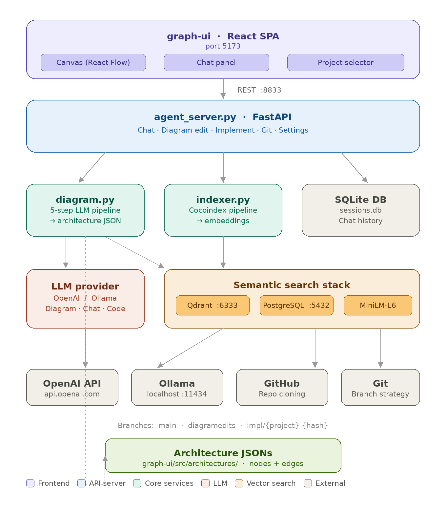

# ArchIDE




An architecture-first IDE where diagrams are the source of truth. You describe a system visually or in natural language — ArchIDE analyzes repositories, generates architecture graphs, and uses AI to plan and write code from the diagram.

---

## How it works

1. **Analyze** a GitHub repo or local path → ArchIDE generates an architecture graph (nodes + edges)
2. **Edit** the diagram on a canvas (drag-and-drop, or natural language commands)
3. **Implement** — AI generates a file-level implementation plan based on diagram changes
4. **Apply** — changes are written to a Git branch and committed automatically

---

## Architecture

```
┌──────────────────────────────────────────┐
│           graph-ui (React SPA)           │
│  Canvas · Chat Panel · Project Selector  │
└────────────────┬─────────────────────────┘
                 │ REST (port 8833)
┌────────────────▼─────────────────────────┐
│         agent_server.py (FastAPI)        │
│  Chat · Diagram edit · Implement · Git   │
└────┬──────────┬──────────────┬───────────┘
     │          │              │
┌────▼───┐ ┌───▼────┐ ┌───────▼───────┐
│diagram │ │indexer │ │  SQLite DB    │
│  .py   │ │  .py   │ │ (sessions)    │
└────┬───┘ └───┬────┘ └───────────────┘
     │         │
┌────▼───┐ ┌───▼────────────────────────┐
│ LLM    │ │ Qdrant (vector DB)         │
│OpenAI /│ │ + PostgreSQL (Cocoindex)   │
│Ollama  │ │ + Sentence Transformers    │
└────────┘ └────────────────────────────┘
```

### Components

| Component | File | Description |
|-----------|------|-------------|
| **Frontend** | `graph-ui/` | React 19 + Vite SPA with drag-and-drop canvas and AI chat |
| **API Server** | `agent_server.py` | FastAPI backend — orchestrates all AI, Git, and diagram operations |
| **Diagram Generator** | `diagram.py` | Analyzes any repo and produces an architecture JSON via a 5-step LLM pipeline |
| **Code Indexer** | `indexer.py` | Embeds a codebase into Qdrant for semantic search during AI chat |
| **Session Store** | `sessions.db` | SQLite database for persistent chat conversations |
| **Architecture JSONs** | `graph-ui/src/architectures/` | Generated per-project graph files (nodes + edges) |

---

## AI Pipeline (`diagram.py`)

When you add a new project, `diagram.py` runs a 5-step LLM pipeline:

| Step | What it does |
|------|-------------|
| **0 — Purpose** | One-sentence summary of what the repo does at runtime |
| **1 — Classification** | Groups components into `Core`, `Supporting`, `Dev` tiers |
| **2 — File Mapping** | Maps each component to its actual path in the repo |
| **3 — Graph Generation** | Produces `{ nodes, edges }` JSON with typed relationships (`CALLS`, `READS`, `DEPENDS_ON`, ...) |
| **4 — Validation** *(optional)* | Cross-checks graph against manifests for missing nodes |
| **5 — Repair** *(optional)* | Patches missing nodes/edges found in validation |

Inputs analyzed: file tree, README, `package.json`, `docker-compose.yml`, `.env.example`, `Prisma schema`, CI/CD configs, entry-point imports.

---

## Code Indexer (`indexer.py`)

Enables semantic code search inside the AI chat (`/search` and context retrieval):

- Reads source files (`.py`, `.ts`, `.js`, `.tsx`, `.go`, `.rs`, `.java`, `.c`, `.cpp`, `.md`, ...)
- Splits code into chunks (1000 tokens, 300 overlap)
- Embeds with **Sentence Transformers** (`all-MiniLM-L6-v2`)
- Stores embeddings in **Qdrant** (one collection per project)
- Pipeline orchestrated by **Cocoindex**

---

## Frontend (`graph-ui/`)

Built with React 19, Vite, Tailwind CSS 4, and React Flow.

**Canvas features:**
- Drag nodes from palette (Core / Supporting / Dev / External tiers)
- Connect nodes port-to-port to define relationships
- Group nodes into container blocks
- Auto-layout via Dagre
- Dirty-state tracking with commit/discard actions

**Chat panel commands:**
| Command | Action |
|---------|--------|
| `/edit <instruction>` | Modify the diagram via AI |
| `/save [label]` | Commit current diagram to Git (`diagramedits` branch) |
| `/implement [hint]` | Generate a file-level implementation plan from diagram diff |
| Free-form text | Architecture Q&A with access to diagram + code search |

---

## Backend API (`agent_server.py`)

Runs on `http://localhost:8833`.

| Method | Endpoint | Description |
|--------|----------|-------------|
| GET | `/api/architectures` | List all projects |
| GET | `/api/architectures/{project}` | Fetch architecture graph |
| DELETE | `/api/architectures/{project}` | Delete project |
| POST | `/api/chat` | Chat with architecture assistant |
| GET | `/api/new_project/stream` | Stream-based repo analysis (SSE) |
| POST | `/api/new_project/cancel` | Cancel running analysis |
| POST | `/api/index_code` | Spawn code indexer |
| GET | `/api/index_status/{project}` | Check if indexed |
| POST | `/api/diagram/edit` | AI-powered diagram edit |
| POST | `/api/diagram/commit` | Save canvas edits to Git |
| POST | `/api/diagram/implement` | Generate implementation plan |
| POST | `/api/diagram/confirm` | Apply plan (write files + commit) |
| POST | `/api/diagram/discard` | Reject pending proposal |
| GET | `/api/diagram/status/{project}` | Check for unimplemented edits |
| GET | `/api/diagram/pending_commits/{project}` | List pending commits |
| GET/POST | `/api/settings` | Read/write LLM config |

---

## External Services

| Service | Purpose | Default location |
|---------|---------|-----------------|
| **OpenAI API** | LLM for diagram generation, editing, and chat | `api.openai.com` |
| **Ollama** | Local/self-hosted LLM alternative | `localhost:11434` |
| **Qdrant** | Vector database for code embeddings | `localhost:6333` (Docker) |
| **PostgreSQL** | Cocoindex metadata store | `localhost:5432` (Docker) |
| **GitHub** | Repo cloning (public repos, or private with token) | `github.com` |
| **Git** | Branch management for diagram + implementation commits | system `git` |

Qdrant and PostgreSQL are started on-demand via Docker when the indexer runs.

---

## Key Libraries

### Python
| Library | Role |
|---------|------|
| **FastAPI** | REST API framework |
| **Cocoindex** | Data pipeline orchestration for code indexing |
| **sentence-transformers** | Code embedding model (`all-MiniLM-L6-v2`) |
| **qdrant-client** | Qdrant vector DB client |
| **anthropic agents SDK** | Powers the architecture assistant agent with tool use |
| **requests** | HTTP client for LLM API calls |
| **python-dotenv** | `.env` loading |

### JavaScript / Frontend
| Library | Role |
|---------|------|
| **@xyflow/react** | Diagram canvas (nodes, edges, drag-and-drop) |
| **dagre** | Automatic hierarchical graph layout |
| **react-markdown** | Markdown rendering in chat panel |
| **Tailwind CSS 4** | Utility-first styling |
| **Vite** | Build tool and dev server |
| **TypeScript** | Type safety across the frontend |

---

## Getting Started

### Prerequisites

- Python 3.11+
- Node.js 20+
- Docker (for Qdrant + PostgreSQL when using code indexing)
- An OpenAI API key **or** a running Ollama instance

### Setup

```bash
# 1. Clone the repo
git clone https://github.com/yourname/archide.git
cd archide

# 2. Install Python dependencies
pip install fastapi uvicorn requests python-dotenv cocoindex \
            sentence-transformers qdrant-client anthropic

# 3. Install frontend dependencies
cd graph-ui && npm install && cd ..

# 4. Configure environment
cp .env.example .env
# Edit .env and set OPENAI_API_TOKEN (or OLLAMA_URL + OLLAMA_API_TOKEN)
```

### Run

```bash
# Terminal 1 — Backend
python agent_server.py

# Terminal 2 — Frontend
cd graph-ui && npm run dev
```

Open `http://localhost:5173`.

### Analyze a repository

```bash
# GitHub repo (cloned automatically)
python diagram.py vercel/next.js --out graph-ui/src/architectures/nextjs.json

# Local project
python diagram.py ./my-project --out graph-ui/src/architectures/my-project.json

# With OpenAI instead of Ollama
python diagram.py owner/repo --provider openai --openai-model gpt-4o
```

---

## Environment Variables

| Variable | Description |
|----------|-------------|
| `OPENAI_API_TOKEN` | OpenAI API key |
| `OPENAI_MODEL` | OpenAI model (default: `gpt-5-nano-2025-08-07`) |
| `PROVIDER` | `openai` or `ollama` (default: `ollama`) |
| `OLLAMA_URL` | Ollama base URL (default: `https://ollama.com`) |
| `OLLAMA_API_TOKEN` | Ollama auth token (optional) |
| `OLLAMA_MODEL` | Ollama model name |
| `GITHUB_TOKEN` | GitHub PAT for private repos / higher rate limits |

---

## Git Branch Strategy

ArchIDE uses Git to track all diagram and implementation changes:

| Branch | Purpose |
|--------|---------|
| `main` | Base branch |
| `diagramedits` | Auto-committed diagram JSON changes |
| `impl/{project}-{hash}` | AI-generated code implementation for a diagram diff |
